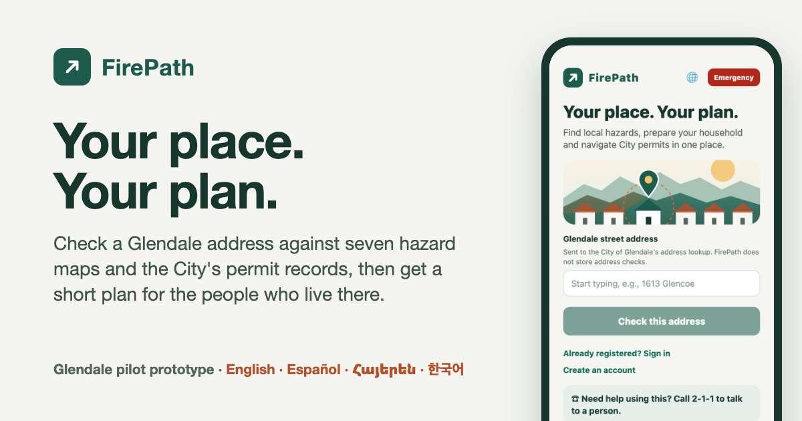

# FirePath — your place, your plan

[](https://github.com/endlessriver-og/firepath_hackathon/actions/workflows/test.yml) [](https://github.com/endlessriver-og/firepath_hackathon/actions/workflows/smoke.yml)

**Try it:** <https://firepath-ruddy.vercel.app> · **Demo video:** <https://youtu.be/7uOw3mHqUbE> · Built at Jewel City Hacks 5.0 (Glendale, September 2026)

[](https://firepath-ruddy.vercel.app)

FirePath turns a Glendale address into a practical preparedness plan for the people who live or work there. Anyone can check an address against seven state and federal hazard maps and the City's own permit and inspection records, with no account. A household or business then adds who is actually there (someone who needs help leaving, kids, pets, hazardous materials) and gets a short numbered checklist, drills for real alert types, one-tap emergency steps and a printable plan.

FirePath is an independent Glendale pilot prototype, not a City of Glendale service. It never replaces official instructions, certified alarms or 911.

## Try it in two minutes

1. Open <https://firepath-ruddy.vercel.app> on a phone.
2. Type an address, for example `1613 Glencoe Way`, and pick the City's suggestion. You see which of the seven maps include it (⚠ with the map's level), and the City's permit and inspection records for that parcel.
3. Tap **Explore the app → Begin** for a five-stop tour with a fictional household: Dana, her daughter, her mother Rosa who uses a walker, and two dogs. No sign-up.
4. On the **Map** tab, switch the view to **3D terrain** and tap any building or lot for its parcel, zoning, fire station district, nearby schools and permit history.
5. Tap **Emergency** (top right, on every screen) and pick a situation.
6. Tap 🌐 (or Profile → Settings) to switch to Español, Հայերեն or 한국어. The app, both maps and the printable sheets follow; City permit names stay in English. The translations are drafts that native speakers have not yet reviewed.
7. Add it to your phone's home screen (Share → Add to Home Screen, or Chrome's Install). It opens full-screen, and once opened it keeps working offline: your saved plan and the Emergency steps still load with no signal.

## What is real, and what is not

| Status | What |
| --- | --- |
| **Live** | City of Glendale address geocoder and public permit/inspection search (Tyler EnerGov). Seven hazard maps: CAL FIRE wildfire severity, FEMA flood, CGS fault, liquefaction and landslide, DWR dam inundation, USGS debris flow (a dated planning snapshot, not live incidents). National Weather Service alerts. LA County Assessor parcels. City zoning, fire station districts, historic districts and schools. |
| **Prototype** | Accounts (scrypt-hashed passwords, hashed bearer sessions) and mailed-code address verification (the code shows in a labelled demo mailbox). A plain-language "What FirePath keeps" note on sign-up and in Settings, and account deletion (Profile → Settings). The responder brief: residents consent and preview it, but nothing is sent to 911, dispatch or the City. The ESP32 in-home alert: firmware compiles and its protocol is tested; it has not yet run on a physical board. City venue packages are labelled examples. |
| **Needs the City** | Evacuation zones and the City alert feed, a dispatch (CAD) test connection, parcel ownership records. The app shows each as a "Needs City data" card naming the dataset and what it would unlock (`src/city-data.js`). |

A point outside a mapped zone is labelled "Outside", never "safe". Weather alerts are not City evacuation orders. FirePath never chooses an evacuation route.

## How it is built

- **Resident app:** Expo / React Native (`apps/mobile`), exported to the web at `/app/`; also bundles for iOS and Android.
- **API:** Node (`server/api.mjs`), dependency-injected so the same routes run locally (`server.mjs`) and as a Vercel function (`api/index.mjs`). On Vercel the account store is one private Vercel Blob document (`server/blob-store.mjs`).
- **Hazard lookups:** [HackerFund's GlendaleGisMcp](https://github.com/HackerFund/GlendaleGisMcp) (GPL-3.0-or-later, installed as a dependency, not vendored). Locally it runs as a Python process (`scripts/lookup-hazards.py`); on Vercel as a Python function (`api/gis.py`) that downloads and verifies the published snapshot on a cold start.
- **Maps:** `map.html` (Leaflet, a graded ~150 m "combined planning index" with a tap-to-explain breakdown and illustrative weights, not an official risk score) and `map3d.html` (MapLibre with OpenFreeMap buildings and AWS terrain tiles). Layers are built by `scripts/build-map-layers.py` into `data/map-layers/`, which is committed.
- **Permits:** `scripts/crawl-permits.mjs` read the City's public permit catalog (75 permit types, 195 work classes, 1,652 business license types) into `src/glendale-permits.json` for plain-language search. FirePath never submits to the City portal and never invents a fee.
- **Languages:** English, Spanish, Armenian and Korean (`apps/mobile/src/i18n.js`, plus phrase tables in `src/playbooks.js`, `src/printouts.js`, the two map pages and the parcel notes). `tests/i18n.test.js` fails if any phrase is missing a language; `npm run check:lang` walks the live screens for leftover English. City permit names, the copyable project summary and the responder brief stay English on purpose.
- **Parcels and neighborhood:** `server/parcels.mjs` (LA County Assessor; assessed values are deliberately not requested) and `server/neighborhood.mjs` (City zoning, historic districts, fire districts, school zones).

## How it is checked

- **On every push:** 66 tests (`npm test`) run in GitHub Actions and again inside the Vercel build, so a failing push never replaces production. They cover the API, including a sweep of malformed input that must never cause a server error, the translations in every language, the printable sheets and the privacy promises.
- **Every 6 hours, against production:** the API smoke test, the guided tour walked in Chrome, an axe accessibility audit (main screens, Armenian, both maps), and checks that the Emergency steps open offline and the app is installable.
- **By hand after UI changes:** `npm run check:layout` walks every screen in all four languages at 320 and 390 px, at normal and large text sizes.

## Run it locally

Requires Node.js 20+ and Python 3.11+.

```bash
cd apps/mobile && npm install && cd ../..
uv venv .venv
uv pip install --python .venv/bin/python 'git+https://github.com/HackerFund/GlendaleGisMcp.git'
.venv/bin/glendale-gis-mcp --fetch-snapshot
npm run build:demo
GLENDALE_GIS_PYTHON=.venv/bin/python npm start
```

Open <http://localhost:5173/app/>. Run `npm test` for the test suite. Local accounts are stored in `data/firepath-dev.json` (gitignored).

**Deploying to Vercel:** `vercel.json` builds the web app and maps and deploys both API functions. The deployment needs a private Blob store connected to the project (`BLOB_READ_WRITE_TOKEN`) and a random `FIREPATH_INTERNAL_KEY`, which restricts the GIS function to FirePath's own API. Check a deploy with `scripts/smoke.sh <url>`.

## More

- [Handoff and repo map](docs/CLAUDE_HANDOFF.md) · [Demo script](docs/DEMO.md) · [Playtest notes](docs/PLAYTEST-2026-09-26.md)
- [Reviewing the translations](docs/TRANSLATION_REVIEW.md) (for native-speaker volunteers)
- [City integration questions](docs/CITY_INTEGRATION.md) · [Mobile and safety plan](docs/MOBILE_AND_SAFETY.md)
- [In-home device wiring and limits](docs/HARDWARE.md) · [Earlier fire-routing lab](docs/FIRE_LAB.md) (`/fire-lab.html`)
- The original browser workspace with a responder training view is at `/classic`.

Call 911 for immediate danger.
